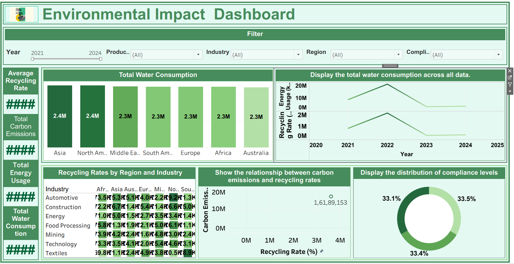
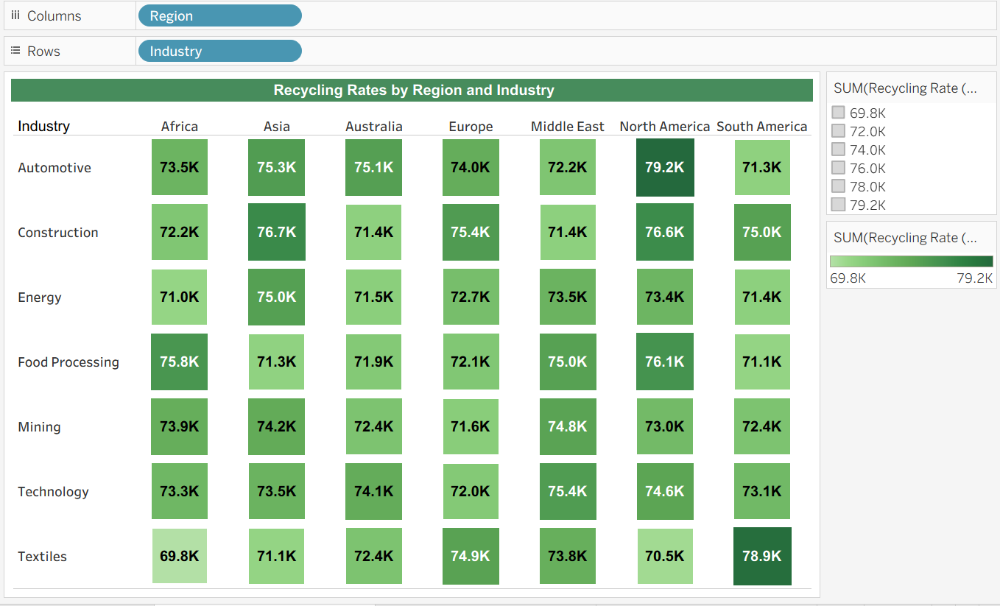

# Environmental Impact Dashboard

This project analyzes environmental performance across different regions and industries using a dataset of 50,000 records. The data was prepared using SQL and visualized in Tableau to understand patterns in carbon emissions, water consumption, recycling rates, and compliance levels.

Live Dashboard:
https://public.tableau.com/app/profile/faizan.hussain8362/viz/environmentaldashboard/Dashboard1?publish=yes

Tools Used:
- SQL
- Tableau
- Excel

Project Overview

The dataset includes metrics such as carbon emissions (kg), water consumption (liters), energy usage (kWh), waste generated, recycling rate (%), AQI, region, industry, product type, compliance level, and year.

Using SQL, I:
- Checked and validated the data
- Removed invalid values
- Calculated total carbon emissions and water consumption
- Computed average recycling rate
- Aggregated emissions and recycling metrics by region and industry

The cleaned data was then used to build an interactive Tableau dashboard with filters for year, region, industry, product type, and compliance level.

Dashboard Screenshots

Full Dashboard Overview

Recycling Rate by Region and Industry (Heatmap)

Carbon Emissions vs Recycling Rate (Scatter Plot)

Energy Usage Trend Over Years (Line Chart)

Repository Contents

- environmental dashboard with recycling rate.twbx
- Data Set environmental impact.xlsx
- sql_queries.sql
- screenshots folder
